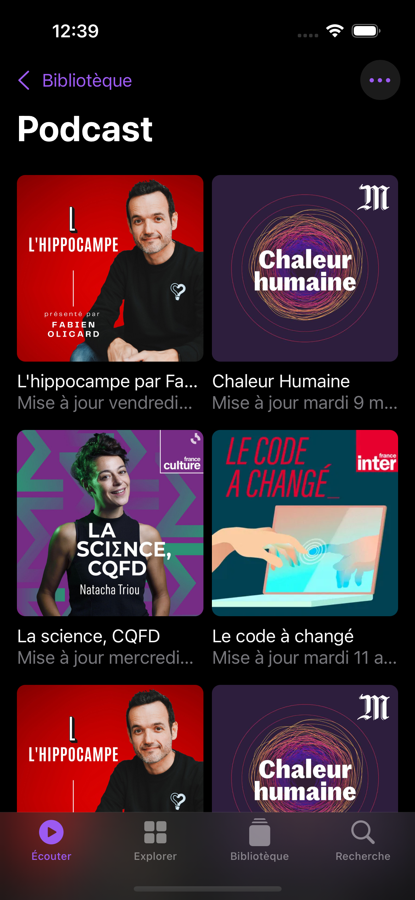
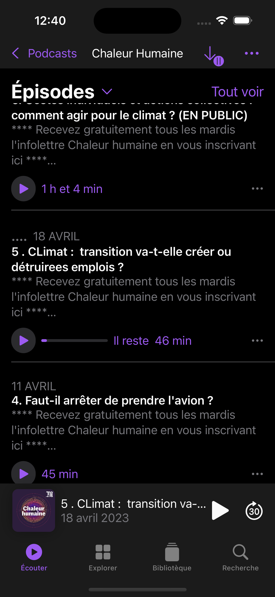

# Podcast
# Overview
This project is a simple example of SwiftUI application that try to reproduce the Podcast UI.
We only have the library page and podcast page with a simple navigation between them.

# Screenshots


<br/>


<br/>


<br/>


<br/>


<br/>



# Features
- [x] iOS (It's a SwiftUI project :D)
- [x] Navigation
- [X] Pages
- [X] Custom Views
- [X] Colors and theming
- [X] Assets
- [X] Bindings (State, ObservedObject, Binding)
- [X] Interactive Playing View
- [X] Updateable Navigation Bar (background and text)
- [X] Blur Tab Bar (only when playing view is not visible)
- [ ] Blur effect Playing View
- [ ] Common line limit for a group of text
- [ ] Multiple text box chained (the next text box start at the end of the text of the previous text box)

# Getting Started
## Prerequisites
- XCode
- iOS Simulator or iOS Device
  
## Installation
1. Clone the repo
   ```sh
   git clone
    ```
2. Open the project with XCode
3. Run the project

# Authors
[](https://github.com/iShoFen)
[](https://www.linkedin.com/in/samuel-sirven-b49b53211/)